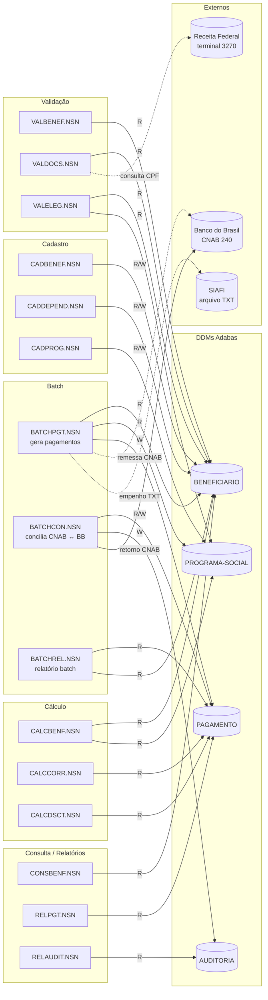
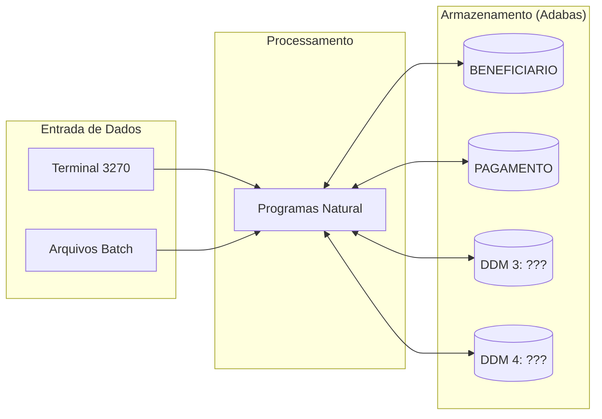

<!-- markdownlint-disable MD013 MD025 MD026 MD028 MD029 MD034 MD040 MD051 MD060 -->

# Mapa de Dependências — SIFAP Legado

  

> 🗺 **Você está aqui:** [Kit PT-BR](../README.md) → [Estágio 1](README.md) → **dependency-map**

> **Para quem é isto?** Este é um **artefato preenchido pelo time** durante o Estágio 1 (Arqueologia).
>
> **O que você terá ao final do estágio:**
>
> 1. Este documento totalmente preenchido com os dados reais do legado SIFAP
> 2. Rastreabilidade para `01-arqueologia/legado-sifap/` (programas `.NSN` e DDMs)
> 3. Base de evidência usada nas EARS do Estágio 2 (`source_legacy:`)
>
> 📘 **Guia passo a passo:** [`GUIDE.md`](GUIDE.md).


> Use diagramas Mermaid para mapear as dependências entre programas Natural e DDMs Adabas.
> O objetivo é visualizar "quem chama quem" e "quem lê/escreve o quê".

## Como descobrir dependências

- **Aviso (achado do Par 2 · 27-mai):** os 15 programas SIFAP **não usam `CALLNAT`**. Todo reuso é feito por `PERFORM` de subrotinas internas. **O acoplamento entre programas vem dos DDMs compartilhados.**
- Para leitura/escrita em DDMs: procure por `READ`, `READ LOGICAL`, `STORE`, `UPDATE`, `DELETE`, `FIND`.
- Para integrações externas: procure por `WORK FILE`, `CNAB`, `SIAFI`, `BANCO`, `RECEITA`.

Comandos PowerShell úteis:

```powershell
# DDMs lidos/escritos por programa
Select-String -Path "01-arqueologia\legado-sifap\natural-programs\*.NSN" -Pattern "READ|STORE|UPDATE|FIND"

# Sistemas externos referenciados
Select-String -Path "01-arqueologia\legado-sifap\**" -Pattern "SIAFI|RECEITA|BANCO|CADUNICO|SERPRO|DATAPREV"
```

## Diagrama de Dependências — Programa ↔ DDM

> Como não há `CALLNAT`, o diagrama foca em **quem lê e quem escreve em cada DDM**. O acoplamento real do legado está nos 4 DDMs compartilhados.



> **Bounded contexts candidatos** (rascunho Par 2, validação no Estágio 2):
>
> 1. `beneficiarios` — CADBENEF, CADDEPEND, CONSBENF (aggregate: BENEFICIARIO)
> 2. `programas` — CADPROG (aggregate: PROGRAMA-SOCIAL)
> 3. `fiscalizacao` — VALBENEF, VALDOCS, VALELEG
> 4. `pagamentos` — CALCBENF, CALCCORR, CALCDSCT, BATCHPGT (aggregate: PAGAMENTO)
> 5. `conciliacao` — BATCHCON (acopla PAGAMENTO + AUDITORIA + BB/SIAFI)
> 6. `auditoria` — RELAUDIT + escritas de BATCHCON (aggregate: AUDITORIA)
> 7. `relatorios` — BATCHREL, RELPGT (view-only, candidato a módulo de leitura)

## Diagrama de Fluxo de Dados (DDMs)



> Substitua "DDM 3: ???" e "DDM 4: ???" pelos nomes reais encontrados em [`../01-arqueologia/legado-sifap/adabas-ddms/`](../01-arqueologia/legado-sifap/adabas-ddms/).

## Tabela de Dependências

> Coluna "Chama (CALLNAT)" fica vazia para todos: nenhum programa SIFAP usa `CALLNAT`. Marcamos `— (não usa)` para deixar explicito.

| Programa | Chama (CALLNAT) | Lê (READ/FIND) DDMs | Escreve (STORE/UPDATE) DDMs | Observações |
| --- | --- | --- | --- | --- |
| CADBENEF.NSN | — (não usa) | BENEFICIARIO | BENEFICIARIO | Cadastro online; chama subrotina interna `VALIDA-CPF` |
| CADDEPEND.NSN | — | BENEFICIARIO | BENEFICIARIO | Dependentes como grupo periódico (PE) |
| CADPROG.NSN | — | PROGRAMA-SOCIAL | PROGRAMA-SOCIAL | Cadastro de programas (Bolsa Família, BPC, …) |
| VALBENEF.NSN | — | BENEFICIARIO | — | Valida CPF/data/nome via `PERFORM` interno |
| VALDOCS.NSN | — | BENEFICIARIO | — | Consulta Receita por terminal 3270 (timeout 30s) |
| VALELEG.NSN | — | BENEFICIARIO, PROGRAMA-SOCIAL | — | Regras de elegibilidade específicas por programa |
| CALCBENF.NSN | — | BENEFICIARIO, PROGRAMA-SOCIAL | — | Determina faixa de renda + base do benefício |
| CALCCORR.NSN | — | PAGAMENTO | — | Índice acumulado de correção |
| CALCDSCT.NSN | — | PAGAMENTO | — | Contribuição social e descontos |
| CONSBENF.NSN | — | BENEFICIARIO | — | Tela 3270 de consulta; mascaramento de CPF |
| BATCHPGT.NSN | — | BENEFICIARIO, PROGRAMA-SOCIAL, PAGAMENTO | PAGAMENTO | Gera ciclo mensal · emite remessa CNAB · envia TXT SIAFI |
| BATCHCON.NSN | — | PAGAMENTO, AUDITORIA, WORK FILE 1 (CNAB BB) | PAGAMENTO, AUDITORIA | Reconcilia retorno bancário; código zumbi Banco Real (ver `mysteries-found.md` MYS-001) |
| BATCHREL.NSN | — | PAGAMENTO, BENEFICIARIO | — | Relatório batch impresso (sem persistência) |
| RELPGT.NSN | — | PAGAMENTO | — | Relatório analitico de pagamentos |
| RELAUDIT.NSN | — | AUDITORIA | — | Relatório de eventos de auditoria |

## Dependências Circulares

> Liste aqui qualquer dependência circular encontrada (programa A chama B que chama A):

- Nenhuma. Como não existe `CALLNAT`, não há ciclos de invocação.
- **Acoplamento por DDM:** BATCHCON e BATCHPGT escrevem ambos em PAGAMENTO (risco de concorrência / regra de ordem batch). Documentar em ADR.

## Programas Órfãos

> Programas que não são chamados por nenhum outro (possíveis pontos de entrada ou código morto):

- **Todos os 15 são "pontos de entrada"** (online via tela 3270 ou jobs batch agendados) — confirmado pela ausência de `CALLNAT`.
- Código morto detectado: bloco `Banco Real` em `BATCHCON.NSN` L207-L220 (ver `mysteries-found.md` MYS-001).

---

### Continuar a leitura

<table width="100%">
<tr>
<td width="50%" valign="top" align="left">
<sub><strong>← ANTERIOR</strong></sub><br/>
<a href="business-rules-catalog.md"><strong>business-rules-catalog.md</strong></a><br/>
<sub>Catálogo de regras.</sub>
</td>
<td width="50%" valign="top" align="right">
<sub><strong>PRÓXIMO →</strong></sub><br/>
<a href="discovery-report.md"><strong>discovery-report.md</strong></a><br/>
<sub>Síntese final.</sub>
</td>
</tr>
</table>

<sub>↑ <a href="README.md">Voltar ao Kit PT-BR</a></sub>

