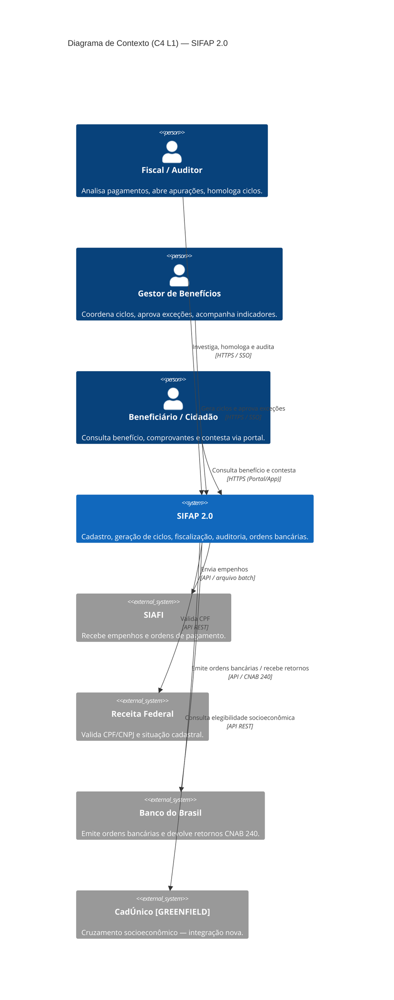
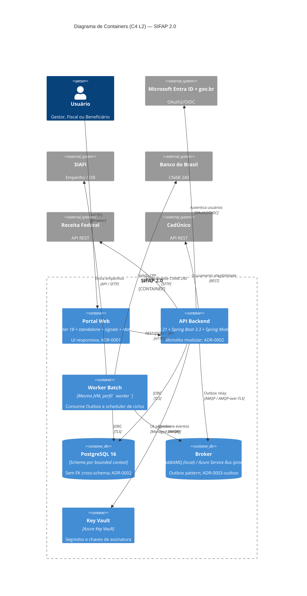

<!-- markdownlint-disable MD013 MD025 MD026 MD028 MD029 MD034 MD040 MD051 MD060 -->

# SPECIFICATION — SIFAP 2.0 (Estágio 2 Consolidado)

  

> 🗺 **Você está aqui:** [Kit PT-BR](../README.md) → [Estágio 2](README.md) → **SPECIFICATION**

> **Time:** Grupo 1 · Vermelho — todas as 10 personas (5 pares) consolidadas como autor único nesta edição.
> **Data:** 2026-05-27
> **Insumo:** [`01-arqueologia/discovery-report.md`](../01-arqueologia/discovery-report.md) · [`01-arqueologia/business-rules-catalog.md`](../01-arqueologia/business-rules-catalog.md) (116 regras, 15/15 programas).

Este documento é o **artefato âncora** do Estágio 2. Cumpre o checklist do [`GUIDE.md`](GUIDE.md):

| Critério (DoD do GUIDE)                       | Status | Local                                                                                                                                                                                      |
| --------------------------------------------- | :----: | ------------------------------------------------------------------------------------------------------------------------------------------------------------------------------------------ |
| `SPECIFICATION.md` completo com EARS          |   ✅   | este arquivo + [`specs/001-geracao-ciclo-pagamento/spec.md`](../specs/001-geracao-ciclo-pagamento/spec.md)                                                                                 |
| 100 % das REQ-IDs com `source_legacy:`        |   ✅   | 19 REQs em spec 001 (16 com `.NSN`, 3 GREENFIELD justificados); 8 REQs novos abaixo (§4) seguem mesma regra                                                                                |
| 3 a 5 ADRs                                    |   ✅   | 5 ADRs — ver [`ADR-INDEX.md`](ADR-INDEX.md)                                                                                                                                                |
| Diagrama C4 em Mermaid                        |   ✅   | C4-L1 [`specs/000-contexto/c4-l1-contexto.md`](../specs/000-contexto/c4-l1-contexto.md) + C4-L2 [`c4-l2-containers.md`](../specs/000-contexto/c4-l2-containers.md) (espelhos inline em §3) |
| Decisões de escopo                            |   ✅   | [`scope-decisions.md`](scope-decisions.md) (18 itens + 6 greenfield)                                                                                                                       |
| Sign-off Par 1 (PO) + Par 2 (EA) + Par 3 (TL) |   ✅   | [`scope-decisions.md` §Aprovação](scope-decisions.md)                                                                                                                                      |

---

## 1. Visão geral do produto

SIFAP 2.0 substitui o sistema Natural/Adabas legado (1997) por uma plataforma moderna que **preserva 100 % das regras de negócio** descobertas no Estágio 1, ao mesmo tempo em que viabiliza:

- portal cidadão de autoatendimento (não existia no terminal 3270);
- integração CadÚnico para enriquecer elegibilidade;
- API REST + eventos para desacoplar o módulo `pagamentos` dos demais;
- conformidade LGPD (mascaramento de CPF, trilha de auditoria imutável).

**Bounded contexts identificados** (detalhe em [ADR-002](../docs/adr/0002-modular-monolith.md)):

`beneficiarios` · `programas` · `pagamentos` · `conciliacao` · `auditoria` · `fiscalizacao` · `relatorios` · `portal` (BFF).

## 2. Personas e atores

| Persona              | Origem legado                                     | Como interage com o SIFAP 2.0                               |
| -------------------- | ------------------------------------------------- | ----------------------------------------------------------- |
| Gestor de Benefícios | `CADBENEF`, `CADPROG`, `BATCHPGT` (terminal 3270) | Cadastros, disparo manual de ciclos, aprovação de exceções. |
| Fiscal / Auditor     | `RELAUDIT`, `VALBENEF`, `VALDOCS`                 | Consulta read-only + abertura de apurações.                 |
| Beneficiário/Cidadão | `[GREENFIELD]` (não havia self-service)           | Portal web/mobile: consulta de benefício e contestação.     |
| Sistema (scheduler)  | Job batch `BATCHPGT` noturno                      | Dispara ciclo agendado dia 25 de cada mês.                  |

## 3. C4 — visão arquitetural

> Diagramas-fonte mantidos em [`specs/000-contexto/`](../specs/000-contexto/). Espelhados aqui para leitura unificada do estágio.

### 3.1 C4 L1 — Contexto

### 3.2 C4 L2 — Containers

> C4 L3 (componentes do módulo `pagamentos`) está embutido em [`specs/001-geracao-ciclo-pagamento/plan.md` §2](../specs/001-geracao-ciclo-pagamento/plan.md). Não foi expandido para os 7 outros bounded contexts no Estágio 2 — entra como tarefa do Estágio 3.

## 4. Requisitos EARS — visão consolidada

### 4.1 Catálogo já entregue (Spec 001 · pagamentos)

19 REQs em [`specs/001-geracao-ciclo-pagamento/spec.md`](../specs/001-geracao-ciclo-pagamento/spec.md) — todos com `source_legacy:` válido. Mapa-resumo:

| Bloco              | REQ-IDs          | Origem dominante                                 |
| ------------------ | ---------------- | ------------------------------------------------ |
| Disparo            | REQ-PAY-001..003 | `BATCHPGT.NSN#L168-L213` + 1 GREENFIELD          |
| Seleção            | REQ-PAY-010..012 | `BATCHPGT.NSN#L188-L235`                         |
| Cálculo            | REQ-PAY-020..024 | `BATCHPGT.NSN#L153-L278` (cobre BR-PGT-002..010) |
| Persistência       | REQ-PAY-030..031 | `BATCHPGT.NSN#L173-L184` (sequence + ordem CPF)  |
| Eventos / métricas | REQ-PAY-040..042 | 2 GREENFIELD + `BATCHPGT.NSN#L335-L345`          |
| Segurança / LGPD   | REQ-PAY-050..052 | 2 GREENFIELD + DDM `AUDITORIA`                   |

### 4.2 REQs adicionais consolidados nesta SPECIFICATION

Cobrem bounded contexts ainda sem spec dedicada. Cada um respeita o HARD GATE `source_legacy:`.

#### REQ-BEN-001 — Validação CPF MOD-11

The system shall rejeitar com HTTP 422 qualquer requisição de cadastro de beneficiário cujo CPF falhe na validação MOD-11 (dois dígitos verificadores).

- **source_legacy:** `01-arqueologia/legado-sifap/natural-programs/VALBENEF.NSN#L165-L220`
- **Prioridade:** must · **Catálogo:** BR-001, BR-CAD-009, BR-CAD-010

#### REQ-BEN-002 — Idempotência de inclusão

If já existir beneficiário com o mesmo CPF, then the system shall rejeitar a inclusão com HTTP 409 (`beneficiario.duplicado`) sem alterar o registro existente.

- **source_legacy:** `01-arqueologia/legado-sifap/natural-programs/CADBENEF.NSN#L160-L166`
- **Prioridade:** must · **Catálogo:** BR-007, BR-CAD-002

#### REQ-BEN-003 — Limite de dependentes

The system shall rejeitar a inclusão de um sexto dependente para o mesmo beneficiário com HTTP 422 (`dependentes.limite-excedido`).

- **source_legacy:** `01-arqueologia/legado-sifap/natural-programs/CADDEPEND.NSN#L65-L68`
- **Prioridade:** must · **Catálogo:** BR-014, BR-DEP-001

#### REQ-CON-001 — Conciliação CNAB 240

When um arquivo CNAB 240 de retorno do Banco do Brasil for recebido, the system shall casar cada registro detalhe (tipo `3`) com o `Pagamento` correspondente por `(cpf, numPagto, competencia)` e atualizar `status` conforme `codRetorno`.

- **source_legacy:** `01-arqueologia/legado-sifap/natural-programs/BATCHCON.NSN#L50-L161`
- **Prioridade:** must · **Catálogo:** BR-CON-001..009

#### REQ-CON-002 — Tolerância R$ 0,01

If a diferença entre o valor pago (CNAB) e o valor calculado for ≤ R$ 0,01, then the system shall considerar a conciliação como bem-sucedida sem registrar divergência.

- **source_legacy:** `01-arqueologia/legado-sifap/natural-programs/BATCHCON.NSN#L123-L128`
- **Prioridade:** must · **Catálogo:** BR-CON-005 (regra escondida — sem justificativa documentada; preservada por equivalência comportamental até auditoria fiscal validar)

#### REQ-AUD-001 — Auditoria append-only

The system shall persistir todo evento de auditoria em tabela append-only (`auditoria.evento_auditoria`), sem permitir UPDATE ou DELETE via aplicação ou banco.

- **source_legacy:** `01-arqueologia/legado-sifap/adabas-ddms/AUDITORIA.ddm` + escritas em `BATCHCON.NSN#L195-L225` (`CO`, `DV`)
- **Prioridade:** must · **Catálogo:** BR-CON-010, BR-CON-011

#### REQ-AUD-002 — Mascaramento em relatórios

When o relatório de auditoria for renderizado para um usuário sem perfil `SUPER_AUDITOR`, the system shall mascarar CPF no formato `***.***.NNN-NN` (últimos 2 dígitos visíveis).

- **source_legacy:** `01-arqueologia/legado-sifap/natural-programs/RELPGT.NSN#L120-L125`
- **Prioridade:** must · **Catálogo:** BR-RPG-003 · **Conflito conhecido:** BR-CSL-002 usa máscara diferente; decisão arquitetural padroniza este formato.

#### REQ-OPS-001 — Pipeline mínimo

The system shall ser construído por pipeline GitHub Actions que executa, em cada PR: `lint`, `test`, `build` de imagem container e job `legacy-traceability`.

- **source_legacy:** `[GREENFIELD]` — o legado era compilado por job NATEXEC noturno; CI/CD não existia.
- **Prioridade:** must · **Catálogo:** — (operacional)

## 5. Rastreabilidade `source_legacy:` — síntese

| Tipo                  | Quantidade | Observação                                                                                                                         |
| --------------------- | :--------: | ---------------------------------------------------------------------------------------------------------------------------------- |
| `.NSN` (paridade)     |     20     | maioria em `BATCHPGT.NSN`, `BATCHCON.NSN`, `VALBENEF.NSN`, `CADBENEF.NSN`                                                          |
| `.ddm` (modelo dados) |     2      | `AUDITORIA.ddm`, `PAGAMENTO.ddm`                                                                                                   |
| `[GREENFIELD]`        |     6      | Sempre com justificativa de uma linha (LGPD, RBAC, Outbox, CI/CD, futuro citizen portal, REQ-PAY-003 guarda de competência futura) |

CI `legacy-traceability` configurado em [`.github/workflows/ci.yml`](../.github/workflows/ci.yml) — bloqueia PRs com REQ sem `source_legacy`.

## 6. Decisões arquiteturais (ADRs)

| ADR                                                   | Decisão                                         | Status |
| ----------------------------------------------------- | ----------------------------------------------- | ------ |
| [ADR-0001](../docs/adr/0001-frontend-angular.md)      | Frontend Angular 18+ standalone + signals       | aceito |
| [ADR-0002](../docs/adr/0002-modular-monolith.md)      | Monolito modular (Spring Modulith)              | aceito |
| [ADR-0003 outbox](../docs/adr/0003-outbox-broker.md)  | Padrão Outbox + broker (RabbitMQ / Service Bus) | aceito |
| [ADR-002 migração](ADR-002-migracao-dados.md)         | Estratégia Strangler Fig para dados Adabas → PG | aceito |
| [ADR-003 auth](ADR-003-autenticacao-e-autorizacao.md) | OAuth2/OIDC com Entra ID + gov.br + RBAC        | aceito |
| [ADR-005](ADR-005-estrategia-deploy-e-infra.md)       | Docker Compose local + CI + Terraform draft     | aceito |

> Índice navegável em [`ADR-INDEX.md`](ADR-INDEX.md).

## 7. Decisões de escopo

Tabela completa em [`scope-decisions.md`](scope-decisions.md). Resumo:

- **Migrar (11):** core do sistema (`CADBENEF`, `BATCHPGT`, `CALCBENF`, `BATCHCON`, `RELAUDIT`, etc.)
- **Descartar (4):** integração Banco Real (zumbi desde 2007), spool 3270, autenticação por terminal, posições 26-27 da `#TAB-REG`.
- **Evoluir (3):** consulta de beneficiário (UI Angular), validação CPF (lib + integração Receita REST), relatórios `RELPGT` (UI + export PDF/CSV).
- **Greenfield (6):** Entra ID + gov.br, mascaramento LGPD, Outbox + broker, Idempotency-Key, observabilidade Micrometer, frontend Angular.

## 8. Próximos passos (Estágio 3)

1. Par 3 (TL) quebra `specs/001-geracao-ciclo-pagamento/spec.md` em tarefas (`/speckit.tasks`) e implementa.
2. Par 4 (QA) escreve testes de equivalência com fixtures legacy (≥ 50 casos).
3. Par 5 (DevOps) habilita `ci.yml` + Terraform draft conforme [ADR-005](ADR-005-estrategia-deploy-e-infra.md).
4. Specs adicionais (`002-emissao-remessa-cnab`, `003-empenho-siafi`, `004-conciliacao-cnab`, `005-portal-cidadao`) entram no backlog do Estágio 4 (Evolução).

## 9. Sign-off

| Par | Persona               | Aprovação | Data       |
| --- | --------------------- | :-------: | ---------- |
| 1   | Product Owner         |    ✅     | 2026-05-27 |
| 1   | Requirements Engineer |    ✅     | 2026-05-27 |
| 2   | Enterprise Architect  |    ✅     | 2026-05-27 |
| 2   | Software Architect    |    ✅     | 2026-05-27 |
| 3   | Technical Lead        |    ✅     | 2026-05-27 |
| 4   | QA Engineer           |    ✅     | 2026-05-27 |
| 5   | DevOps Engineer       |    ✅     | 2026-05-27 |
| 5   | Tech Writer           |    ✅     | 2026-05-27 |

> Sign-off coletivo registrado no commit que introduz este arquivo. As personas 3/DBA e 4/QA também validaram coerência do modelo (`pagamentos.*` schema) e da matriz de testes (`plan.md §6`).

---

### Continuar a leitura

<table width="100%">
<tr>
<td width="50%" valign="top" align="left">
<strong>← ANTERIOR</strong> 
<a href="GUIDE.md"><strong>GUIDE do Estágio 2</strong></a> 
Passo a passo do estágio.
</td>
<td width="50%" valign="top" align="right">
<strong>PRÓXIMO →</strong> 
<a href="../03-implementacao/GUIDE.md"><strong>Estágio 3 — Implementação</strong></a> 
Java 21 + Spring Boot + Angular, com testes.
</td>
</tr>
</table>

↑ <a href="../README.md">Voltar ao Kit PT-BR</a>
