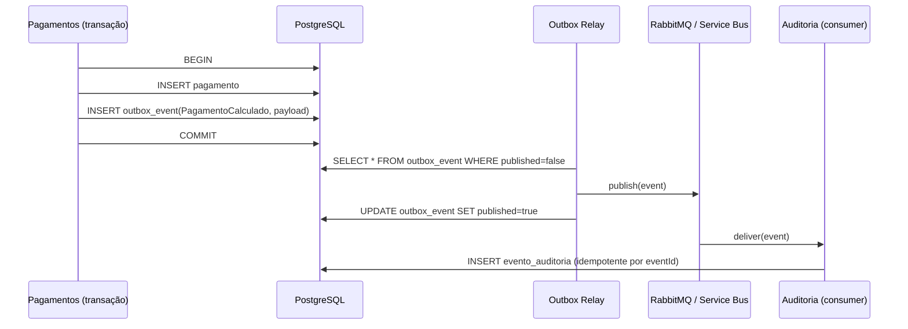

<!-- markdownlint-disable MD013 MD025 MD026 MD028 MD029 MD034 MD040 MD051 MD060 -->

# ADR-0003: Comunicação inter-contexto via Outbox + broker

 

> 🗺 **Você está aqui:** [Kit PT-BR](../../README.md) → [Docs](../README.md) → [ADRs](README.md) → **0003**

> Adotamos o padrão **Transactional Outbox** para publicar eventos de domínio inter-contexto. RabbitMQ no ambiente local, Azure Service Bus em produção.

| Campo      | Valor |
| ---------- | ----- |
| Status     | aceito |
| Data       | 2026-05-27 |
| Autores    | Software Architect (Par 2) |
| Substitui  | N/A |

## Contexto

[ADR-0002](0002-modular-monolith.md) define que contextos só se comunicam por (a) eventos de domínio ou (b) interfaces públicas. Eventos cruzam fronteiras assíncronas: `pagamentos` → `auditoria`, `fiscalizacao` → `pagamentos`, `conciliacao` → `pagamentos`/`auditoria` etc.

REQ-PAY-040 e REQ-PAY-041 exigem que eventos sejam publicados **garantidamente** após a transação que originou o estado — sem perda nem duplicação silenciosa. Publicar diretamente para o broker dentro da transação JPA cria dois problemas conhecidos:

1. **Dual-write:** se o broker estiver indisponível mas o commit for OK → evento perdido.
2. **Rollback inconsistente:** se o commit falhar mas o evento já foi publicado → consumidor age sobre estado fantasma.

A modernização precisa também sobreviver a:

- **Restart do worker** sem reprocessar duas vezes (idempotência no consumidor).
- **Ambiente local sem Azure** (workshop em laptop).
- **Migração futura** entre brokers sem reescrever consumidores.

## Decisão

Vamos adotar **Transactional Outbox** com Spring Modulith `@ApplicationModuleListener` + tabela `outbox_event` no mesmo schema do agregado emissor.

### Mecânica

### Regras

1. **Toda escrita inter-contexto** passa por evento; nenhuma chamada síncrona cross-package fora de `api/`.
2. **`outbox_event(id UUID, aggregate_type, aggregate_id, type, payload JSONB, occurred_at, published, attempts)`** vive no schema do contexto emissor.
3. **Relay = Spring Modulith Externalization** com poll de 1 s (configurável); em produção pode ser substituído por Debezium se carga exigir.
4. **Idempotência no consumidor:** consumidores rastreiam `eventId` processados em tabela `processed_event(event_id PRIMARY KEY)` e ignoram duplicatas.
5. **Schema de evento versionado:** `type = "pagamentos.PagamentoCalculado.v1"`. Quebras de schema exigem nova versão; consumidores assinam versões específicas.
6. **Ambiente local:** `docker-compose` sobe RabbitMQ; perfil `local`. Produção: Azure Service Bus com Managed Identity.
7. **Dead-letter:** após `attempts >= 5`, evento vai para tópico DLQ e gera alerta.

### Convenção de nomes

- Tópico/fila: `sifap.<contexto>.<aggregate>.<versao>` (ex.: `sifap.pagamentos.pagamento.v1`)
- Tipo do evento (no payload): `<contexto>.<EventoPascalCase>.v<n>`

## Alternativas consideradas

| Alternativa | Por que foi rejeitada |
| --- | --- |
| **Chamada REST síncrona entre contextos** | Acopla disponibilidade; perde a propriedade de auditoria garantida; viola ADR-0002 (fronteira só por eventos). |
| **Publicar direto no broker dentro do `@Transactional`** | Dual-write; perda silenciosa quando broker está fora; rollback inconsistente. |
| **Change Data Capture (Debezium)** desde o início | Adiciona infra (Kafka Connect) desproporcional ao workshop; podemos migrar depois sem alterar produtores. |
| **Event sourcing puro** (sem CRUD) | Reescreve modelo de dados de todos os contextos; risco alto para janela do workshop; só `auditoria` precisa de append-only. |
| **Spring `ApplicationEvent` em memória** | Não sobrevive a restart; não cruza JVMs; só serve dentro do mesmo módulo. |

## Consequências

- **Mais fácil:** atomicidade garantida; reprocessamento trivial (reset `published=false`); observabilidade nativa (tabela é o histórico).
- **Mais difícil:** consumidores precisam ser idempotentes (custo aceitável); latência mínima de 1 s entre commit e entrega (aceitável para auditoria e relatórios).
- **Riscos:**
  - Tabela `outbox_event` crescer indefinidamente. **Mitigação:** job de housekeeping move eventos publicados há > 30 dias para tabela arquivo + Blob.
  - Schema-drift entre produtor e consumidor. **Mitigação:** versionar evento + testes de contrato (Pact ou JSON Schema no `contracts/`).
  - Relay travado → backlog. **Mitigação:** alerta sobre `lag = count(published=false)` > 100 ou `oldest_unpublished_age` > 5 min.

## Relacionado

- REQ-IDs: REQ-PAY-040, REQ-PAY-041, REQ-PAY-052
- ADRs: [ADR-0002](0002-modular-monolith.md)
- Arquivos-fonte: [`specs/001-geracao-ciclo-pagamento/spec.md`](../../specs/001-geracao-ciclo-pagamento/spec.md)
- Referências externas: [Spring Modulith — Externalizing Events](https://docs.spring.io/spring-modulith/reference/events.html) · [Microservices.io — Outbox Pattern](https://microservices.io/patterns/data/transactional-outbox.html)
