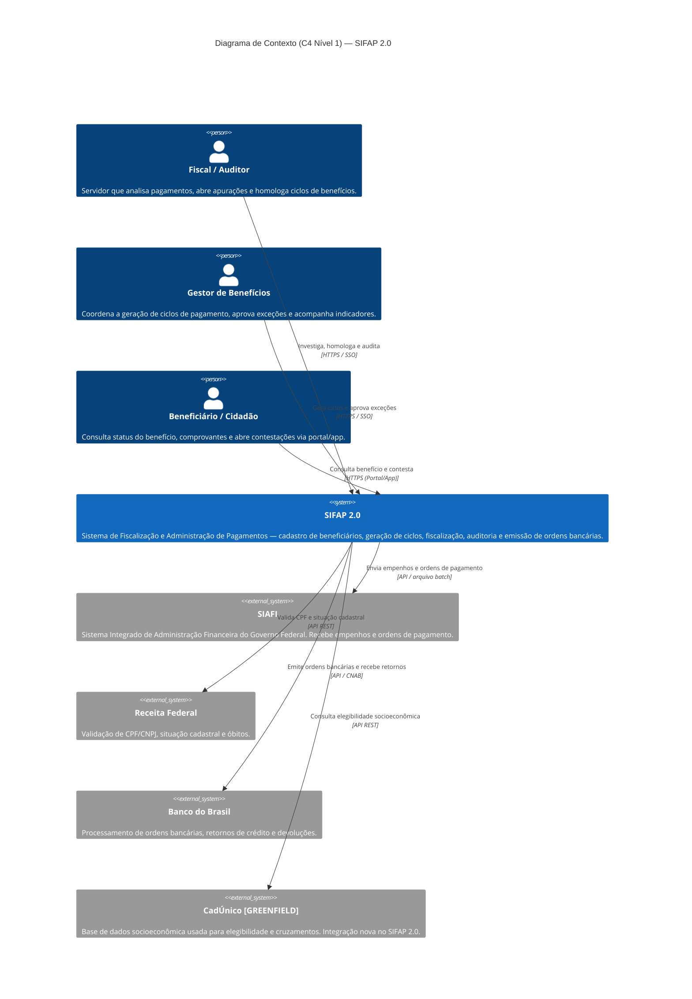

<!-- markdownlint-disable MD013 MD025 MD026 MD028 MD029 MD034 MD040 MD051 MD060 -->

# C4 Nível 1 — Diagrama de Contexto do SIFAP 2.0

| Campo | Valor |
| --- | --- |
| Status | proposto |
| Autores | Par 2 · Arquitetura (Enterprise Architect + Software Architect) |
| Relacionado | [c4-l2-containers.md](c4-l2-containers.md) · [ADR-0001 frontend Angular](../../docs/adr/0001-frontend-angular.md) |
| Origem legado | sistema completo SIFAP (15 programas `.NSN` + 4 DDMs) |

> Diagrama de contexto agnóstico de tecnologia: mostra atores, o sistema SIFAP 2.0 e os 4 sistemas externos integrados. A decisão de stack frontend (Angular) só aparece no L2.

## Rastreabilidade legado → atores e externos

| Elemento | Tipo | `source_legacy:` |
| --- | --- | --- |
| Fiscal / Auditor | Person | 01-arqueologia/legado-sifap/natural-programs/RELAUDIT.NSN · VALBENEF.NSN · VALDOCS.NSN |
| Gestor de Benefícios | Person | 01-arqueologia/legado-sifap/natural-programs/CADBENEF.NSN · CADPROG.NSN · BATCHPGT.NSN |
| Beneficiário / Cidadão | Person | 01-arqueologia/legado-sifap/natural-programs/CONSBENF.NSN · `[GREENFIELD]` portal de autoatendimento (não existia no legado terminal) |
| SIAFI | System_Ext | 01-arqueologia/legado-sifap/natural-programs/BATCHCON.NSN · 01-arqueologia/legado-sifap/legacy-docs/ARQUITETURA-ORIGINAL-1997.md (§5) · README.md (§integrações) |
| Receita Federal | System_Ext | 01-arqueologia/legado-sifap/README.md (§integrações — consulta CPF online via transação Natural / terminal 3270) · VALDOCS.NSN · VALBENEF.NSN |
| Banco do Brasil | System_Ext | 01-arqueologia/legado-sifap/natural-programs/BATCHCON.NSN (CNAB 240) · BATCHPGT.NSN (emissão de remessa) |
| CadÚnico | System_Ext | `[GREENFIELD]` — sem ocorrência no legado SIFAP; integração pretendida para enriquecer elegibilidade socioeconômica no SIFAP 2.0 |

> O portal do beneficiário e a integração com CadÚnico são marcados como **GREENFIELD** — o SIFAP legado roda apenas em terminal verde para servidores e não consulta CadÚnico. Justificativa: REQ moderno de autoatendimento cidadão + cruzamento socioeconômico, ambos sem equivalente no legado.

> **Atualização pós-arqueologia (Par 2):** a Receita Federal era consultada **online por terminal 3270** (timeout 30s), não por REST. O contrato moderno (API REST) substitui essa integração.

## Diagrama

## Decisões

- **Notação:** `C4Context` nativo do Mermaid — renderiza em GitHub, VS Code preview e Spec-Kit sem plugin.
- **3 atores escolhidos:** cobrem todos os fluxos do legado (fiscalização, administração) + 1 ator novo (cidadão).
- **4 sistemas externos:** SIAFI, Receita Federal, Banco do Brasil — confirmados na arqueologia (Par 2). CadÚnico marcado como `[GREENFIELD]` (sem ocorrência no legado). Dataprev/SERPRO/TCU não foram identificados; se aparecerem na síntese, promover para externos.
- **Protocolos:** o legado usava terminal 3270 (Receita) e arquivo batch TXT (SIAFI/CNAB). O SIFAP 2.0 padroniza REST/CNAB modernos — diferença a registrar em ADR de integração.
- **Stack:** **omitida** propositalmente no L1 — escolhas técnicas vivem no L2 + ADRs.

## Pendências

- [ ] Par 1 (PO + RE) confirmar que o portal cidadão e a integração CadÚnico são REQs aprovados (não suposições arquiteturais).
- [ ] Par 2 fechar análise completa de `01-arqueologia/legado-sifap/` para garantir que não há quinto sistema externo.
- [ ] Atualizar `01-arqueologia/dependency-map.md` com os mesmos elementos para consistência.
