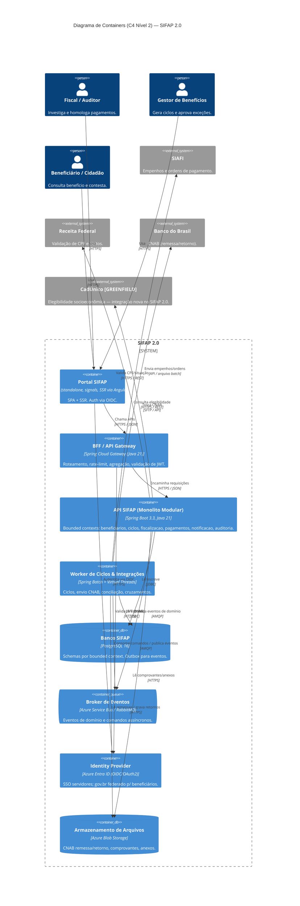

<!-- markdownlint-disable MD013 MD025 MD026 MD028 MD029 MD034 MD040 MD051 MD060 -->

# C4 Nível 2 — Diagrama de Containers do SIFAP 2.0

| Campo | Valor |
| --- | --- |
| Status | proposto |
| Autores | Par 2 · Arquitetura (Enterprise Architect + Software Architect) |
| Relacionado | [c4-l1-contexto.md](c4-l1-contexto.md) · [ADR-0001 frontend Angular](../../docs/adr/0001-frontend-angular.md) · [`.github/instructions/modular-monolith.instructions.md`](../../.github/instructions/modular-monolith.instructions.md) |

> Detalha os containers internos do SIFAP 2.0 já com a stack definida: Angular no front, monolito modular Spring Boot, BFF, worker batch, broker, PostgreSQL e Blob Storage. Mantém atores e externos do L1.

## Rastreabilidade legado → containers

| Container | `source_legacy:` |
| --- | --- |
| Portal SIFAP (Angular) | 01-arqueologia/legado-sifap/natural-programs/CONSBENF.NSN · CADBENEF.NSN · CADPROG.NSN |
| BFF / API Gateway | `[GREENFIELD]` — não havia camada de gateway no terminal Natural; necessária para Angular + JWT |
| API SIFAP (Monolito Modular) | 01-arqueologia/legado-sifap/natural-programs/CADBENEF.NSN · CADDEPEND.NSN · CALCBENF.NSN · CALCCORR.NSN · CALCDSCT.NSN · VALBENEF.NSN · VALDOCS.NSN · VALELEG.NSN |
| Worker de Ciclos & Integrações | 01-arqueologia/legado-sifap/natural-programs/BATCHPGT.NSN · BATCHCON.NSN · BATCHREL.NSN · RELAUDIT.NSN · RELPGT.NSN |
| Banco SIFAP (PostgreSQL) | 01-arqueologia/legado-sifap/adabas-ddms/*.ddm (todos os 4 DDMs) |
| Broker de Eventos | `[GREENFIELD]` — desacoplamento entre módulos do monolito + worker (não existia no legado batch sequencial) |
| Identity Provider (Entra ID) | `[GREENFIELD]` — substitui auth do terminal Natural por SSO corporativo + gov.br |
| Blob Storage | 01-arqueologia/legado-sifap/natural-programs/BATCHPGT.NSN (remessa CNAB) · BATCHCON.NSN (retorno CNAB) |

> **Atualização pós-arqueologia (Par 2):**
>
> - **CadÚnico = GREENFIELD.** Não há nenhuma referência a CadÚnico nos 15 `.NSN`. A integração é nova e deve ser tratada como REQ moderno.
> - **Receita Federal no legado = terminal 3270 (online, timeout 30s).** O contrato moderno (REST) substitui isso — abrir ADR de integração com Receita.
> - **SIAFI no legado = arquivo TXT batch (não API).** Idem — ADR define o caminho moderno (API SIAFI ou seguir arquivo).
> - **Não há `CALLNAT` entre os 15 programas.** O acoplamento vem dos DDMs compartilhados — ver [dependency-map.md](../../01-arqueologia/dependency-map.md).

## Diagrama

## Decisões L2

- **Frontend Angular 18+** standalone components + signals + SSR opcional (Angular Universal). Substitui Next.js. Ver [ADR-0001](../../docs/adr/0001-frontend-angular.md).
- **Monolito modular** Spring Boot, alinhado a [`.github/instructions/modular-monolith.instructions.md`](../../.github/instructions/modular-monolith.instructions.md). Evita microsserviços prematuros.
- **BFF separado** (Spring Cloud Gateway) para isolar Angular do monolito, simplificar CORS/JWT e permitir agregação para o portal.
- **Worker dedicado** (Spring Batch + virtual threads) para ciclos e integrações pesadas — não impacta request/response.
- **Mensageria** Azure Service Bus em produção; RabbitMQ no Compose local. Padrão **Outbox** persistido no PostgreSQL para consistência transacional.
- **Blob Storage** para CNAB e anexos — nunca `bytea` no Postgres.
- **IdP** Azure Entra ID para servidores; gov.br federado para cidadãos.
- **Roteamento dos externos:** REST síncrono (Receita, CadÚnico) fica na API; arquivos/batch (SIAFI, BB) ficam no worker.

## Pendências (a abrir como ADRs)

- [ ] ADR — Monolito modular vs. microsserviços
- [ ] ADR — BFF com Spring Cloud Gateway
- [ ] ADR — Mensageria + padrão Outbox
- [ ] ADR — Armazenamento de arquivos em Blob

## Decisões abertas

- **Notificações:** recomendado como módulo dentro da API + consumer no broker (não container separado).
- **Observabilidade:** Azure Monitor/App Insights via SDK (sem container dedicado).
- **Cache (Redis):** adiar até medir necessidade.
